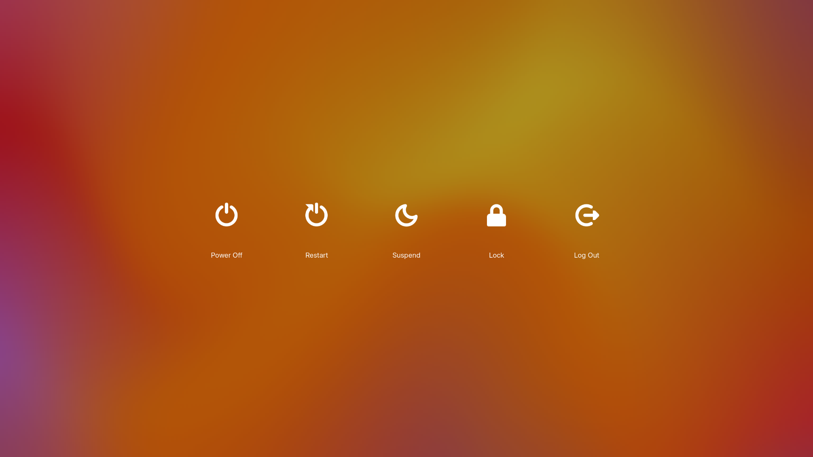

# Power Menu

A GNOME Shell extension that adds a power button to the top panel. Clicking
it opens a full-screen menu — with a blurred background —
for quickly powering off, restarting, suspending, locking, or logging out.


## 🖥️ Screenshot
### Full screen power menu



## Features

- **One click, no sub-menu.** A single power icon in the top panel opens a
  full-screen overlay directly — no nested menu to dig through.
- **Five actions:** Power Off, Restart, Suspend, Lock, and Log Out.
- **Skips the extra confirmation dialog - still respecting real inhibitors (e.g. unsaved documents).
- **Keyboard-friendly:** arrow keys move focus between actions, Enter/Space
  activates the focused one, Escape closes the menu.
- **Click anywhere outside the buttons** to dismiss.
- **Uses GNOME Shell's own translations** so it follows your system language.

## Requirements

- GNOME Shell 49, 50, tested on 51.beta

## 🚀 Installation
---------------

### Method 1: 📦 Available on extensions.gnome.org:
Install Power Menu via [extensions.gnome.org](https://extensions.gnome.org/extension/10732/power-menu//)

 <a href="https://extensions.gnome.org/extension/10732/power-menu/" target="_blank"></img></a>

    
### Manual installation

1. Download or clone this repository.
2. Copy the extension folder into your local extensions directory, named
   after its UUID:

   ```bash
   git clone https://github.com/dodog/power-menu.git \
       ~/.local/share/gnome-shell/extensions/power-menu@dodog.github.io
   ```

3. Compile gschemas:
    ```bash
   glib-compile-schemas ~/.local/share/gnome-shell/extensions/power-menud@dodog.github.io/schemas/
    ```
5. Restart GNOME Shell:
   - **Wayland:** log out and back in.
6. Enable the extension:

   ```bash
   gnome-extensions enable power-menu@dodog.github.io
   ```

   or use the **Extensions** app (`gnome-extensions-app`) to toggle it on.

## Usage

Click the power icon in the top panel to open the menu. From there:

- Click an action, or use the **arrow keys** to move between actions and
  **Enter**/**Space** to activate the highlighted one.
- Press **Escape** or click anywhere outside the buttons to close the menu
  without doing anything.

## File structure

| File                     | Purpose                                             |
| ------------------------ | ---------------------------------------------------- |
| `metadata.json`           | Extension metadata (UUID, name, supported versions). |
| `extension.js`             | Entry point — enables/disables the panel indicator.  |
| `powerMenuIndicator.js`    | The panel button.                                    |
| `powerMenuOverlay.js`      | The full-screen menu: background, buttons, actions.  |
| `stylesheet.css`           | Styling for the overlay and buttons.                 |

## Contributing

Issues and pull requests are welcome. Please test any changes on a
GNOME Shell before submitting.

## ❤️ Support

Like this extension? Give it a ⭐ on GitHub. And if you really like it, you can buy me a coffee:

- ☕ [Buy Me a Coffee](https://www.buymeacoffee.com/dodog)

## License

GPL-3.0 see [`LICENSE`](LICENSE) for details.
